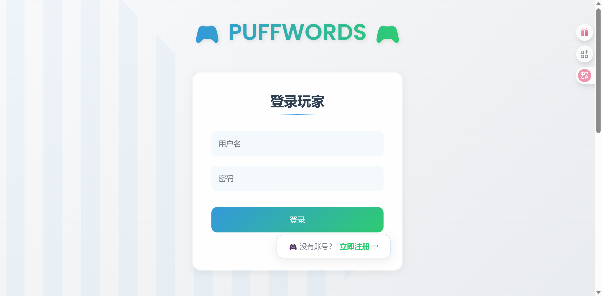
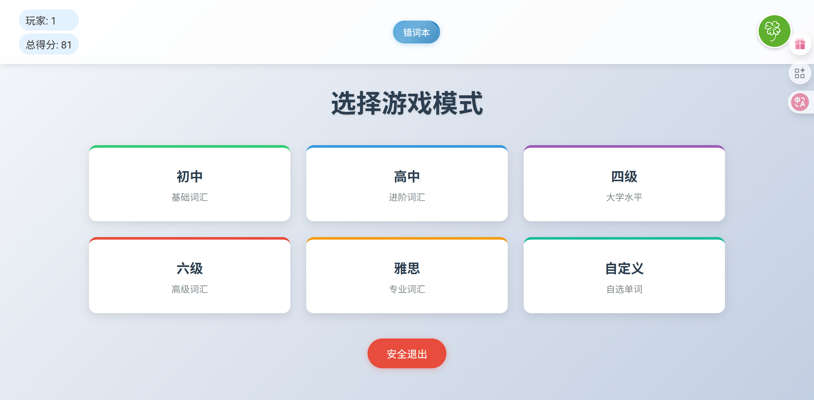
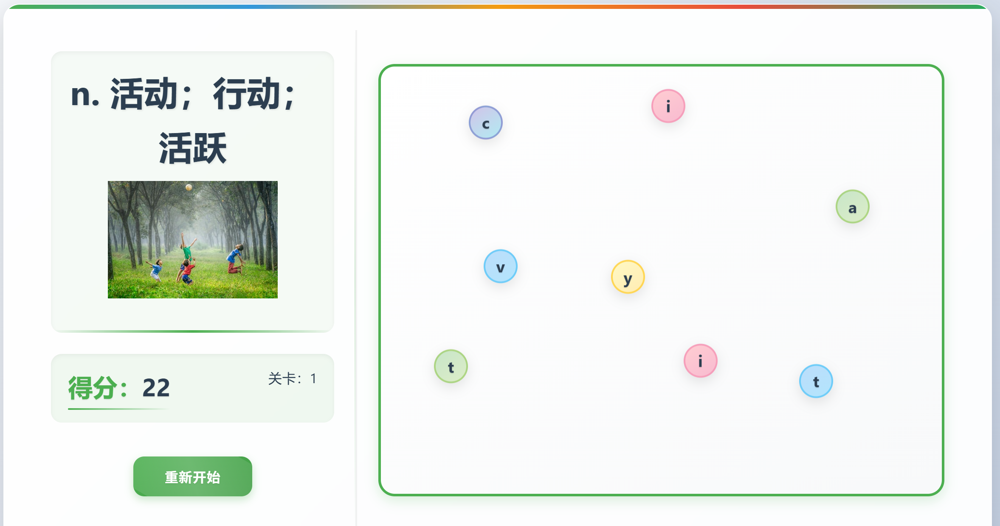
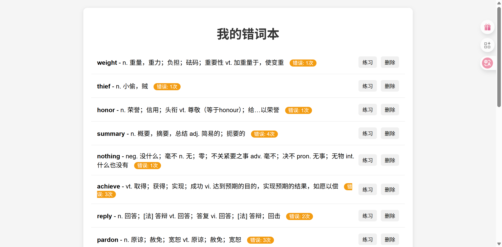
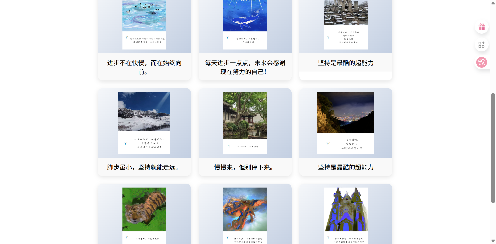

#  PUFFWORDS 记忆词语游戏
一个轻量级的英语单词记忆与练习平台，结合前端动画交互和后端用户数据管理，实现个性化错题本、奖励机制、进度保存等功能。
---
## 项目功能简介
-  用户登录与进度保存（支持 JWT 验证）
-  5 类单词难度选择，每关包含 50 个词
-  错题本功能：记录每个用户的错误单词
-  奖励机制：根据得分解锁不同图片
-  动画泡泡弹出 + 背景音乐增强交互体验
-  自定义单词词库，实现个性化需求
-  图片调用 Unsplash API 实现词图联想
-  管理员端可通过 Flyway 管理数据库结构
---
## 🛠 技术栈
| 前端           | 后端         | 数据库      | 其他工具   |
|----------------|--------------|-------------|------------|
| HTML + CSS + JS | Node.js + Express | MySQL + Flyway | dotenv / axios / jwt / bcrypt |
---
##  项目结构
```
GAME-SERVER/
├── flyway/
│   ├── flyway.conf
│   ├── V1_schema.sql
│   ├── V2_create_wrong_wor... (不完整文件名)
│   └── V3_insert_more_rewar... (不完整文件名)
├── logs/
│   ├── combined.log
│   └── error.log
├── node_modules/
├── public/
│   ├── assets/
│   │   ├── 鲸.png
│   │   ├── bubble-sound.mp3
│   │   ├── desktop.ini
│   │   ├── fail.mp3
│   │   ├── great-sound.mp3
│   │   └── WOW.png
│   ├── css/
│   │   ├── home.css
│   │   ├── pre.css
│   │   ├── rewards.css
│   │   └── style.css
│   ├── img/
│   ├── js/
│   │   ├── api.js
│   │   ├── game.js
│   │   ├── home.js
│   │   ├── pre.js
│   │   ├── rewards.js
│   │   ├── setting.js
│   │   ├── words.js
│   │   └── wrong-words.js
│   ├── utils/
│   ├── .env
│   ├── home.html
│   ├── index.html
│   ├── pre.html
│   ├── rewards.html
│   ├── setting.html
│   └── wrong-words.html
├── insert_data.sql
├── migrate-dev.bat
├── package-lock.json
├── package.json
└── README.md
```
---
##  启动方式
###  1. 克隆项目
```bash
git clone https://github.com/kaka666111/puffwords.git
cd PUFFWORDS
 2. 安装依赖（后端）
cd GAME-SERVER
npm install
3. 添加 .env 文件（手动创建）
DB_HOST=localhost
DB_USER=root
DB_PASSWORD=yourpassword
DB_NAME=game
UNSPLASH_ACCESS_KEY=your_unsplash_key
SECRET_KEY=your_jwt_secret
4. 初始化数据库（使用 Flyway）
确保你已安装 Flyway，并运行：
flyway -configFiles=flyway/flyway.conf migrate
5. 启动服务
node server.js
浏览器访问： http://localhost:3000/pre.html

页面预览







TODO
    • 增加排行榜功能，好友共学pk功能
    • 前端改写为 Vue 重构版本（进行中）
    • 结合音游式单词的游戏方式

 License
MIT License - 本项目开源用于学习交流，欢迎 Fork 和 Star 🌟

 鸣谢
    • 图片来源：Unsplash
    需要使用时自行申请Unsplash的API，否则会导致图片加载失败。

# 数据库迁移说明

## 一、结构迁移（Flyway 管理）
所有数据库结构变化请新建文件：

- 文件名格式：`V版本号__描述.sql`
- 示例：`V2__add_reward_table.sql`

放在 `flyway/` 目录中，Flyway 会自动识别并执行。

## 二、插入奖励图（insert_data.sql 管理）
奖励图像数据放在根目录的 `insert_data.sql` 中，每次迁移时自动执行。
请使用 `INSERT IGNORE` 以避免重复插入。

## 三、一键迁移执行方式
运行：

```bash
.\migrate-dev.bat
